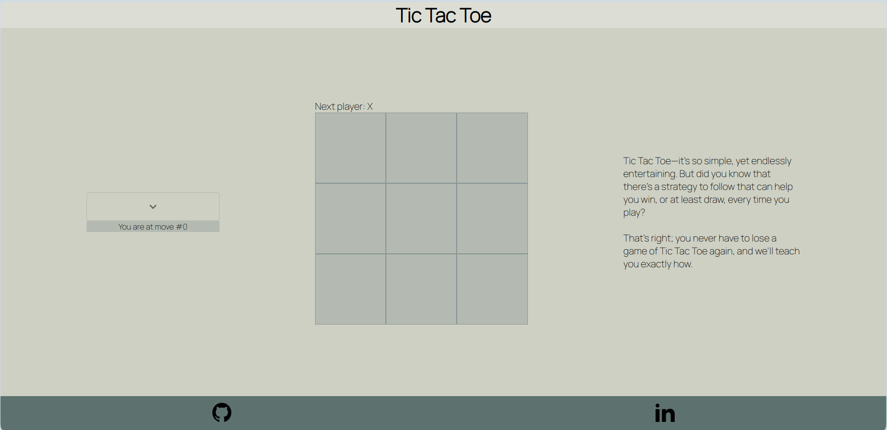

# Tic-Tac-Toe

Welcome to the Tic Tac Toe game! This project is a React/TypeScript application that allows you to play the classic game of Tic Tac Toe. The game is designed to be user-friendly and intuitive, providing an enjoyable experience for players of all ages.

Our game comes packed with user-friendly features designed to enhance your gameplay.

- The left panel provides the convenience of revisiting previous moves, allowing you to reflect on the game's progression.

- On the right, find helpful guidance tailored for player X, suggesting optimal moves to elevate your strategic approach.



Initially inspired by the step-by-step [tutorial](https://react.dev/learn/tutorial-tic-tac-toe)
provided on the official React website.

## Installation

### 1. Clone the Repository

Use the following command to clone the repository to your local machine:

```bashl
git clone https://github.com/AntoineROYERB/Tic-Tac-Toe.git
```

### 2. Navigate to the Project Directory

Move into the project directory with the following command:

```bash
cd Tic-Tac-Toe
```

### 3. Install Dependencies

Use npm to install the project dependencies:

```bash
npm install
```

This will install the necessary packages and dependencies for the Tic Tac Toe project.

Now you have successfully cloned the repository and installed the required dependencies. You can proceed to explore or modify the project as needed.

### 4. Start the Development Server:

Launch the development server by running the following command:

```bash
npm start
```

This command will start the development server and open the Tic Tac Toe application in your default web browser.

### 5. Acces the Application

Once the development server is running, you can access the Tic Tac Toe application by navigating to http://localhost:3000 in your web browser.

Now you have successfully started the Tic Tac Toe application locally. Explore the game, make moves, and enjoy playing!
